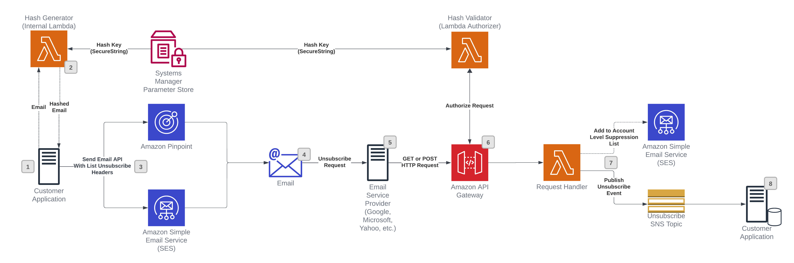

# email-one-click-unsubscribe

>**BE AWARE:** This code base is an [Open Source](LICENSE) starter project designed to provide a demonstration and a base to start from for specific use cases. 
It should not be considered fully Production-ready.
If you plan to deploy and use this in a Production environment please review the [Using this in Production](#using-this-in-production) section at the end for some additional guidance.

## Use-case scenario

[Gmail](https://blog.google/products/gmail/gmail-security-authentication-spam-protection/) and [Yahoo](https://blog.postmaster.yahooinc.com/post/730172167494483968/more-secure-less-spam) have announced new [requirements](https://aws.amazon.com/blogs/messaging-and-targeting/an-overview-of-bulk-sender-changes-at-yahoo-gmail/) for bulk email senders that take effect in June 2024. The requirements aim to reduce delivery of malicious or unwanted email to the users of these mailbox providers. The bulk sender easy subscription requirement references use of the List-Unsubscribe email header [RFC2369](https://www.ietf.org/rfc/rfc2369.txt) and List-Unsubscribe-Post email header [RFC8058](https://datatracker.ietf.org/doc/html/rfc8058). 

* List-Unsubscribe: <https://example.com/?h=xxxxxxx&topic=x>
* List-Unsubscribe-Post: List-Unsubscribe=One-Click

These headers enable email clients and inbox providers to display an unsubscribe link at the top of the email if they support it. This could take the form of a menu item, push button, or another user interface element to simplify the user experience.

This starter project will deploy a sample architecture to handle One Click Unsubscribes as described in [this blog post](https://aws.amazon.com/blogs/messaging-and-targeting/using-one-click-unsubscribe-with-amazon-ses/)

> NOTE: This solution presents a reference architecture for Amazon SES senders who independently manage email subscriptions outside of Amazon SES. Alternatively, Amazon SES senders can employ our [native subscription management capability](https://docs.aws.amazon.com/ses/latest/dg/sending-email-subscription-management.html) as part of their compliance with the Gmail and Yahoo bulk sender requirements. 

## Solution components

On a high-level, the solution consists of the following components, each contained in a separate folder:

* cdk-stacks - AWS CDK stacks:
    - `cdk-backend-stack` with all the backend resources needed for the solution (AWS Lambda, Amazon API Gateway, Amazon Cognito etc)

### Solution architecture:  


## Solution prerequisites
* AWS Account
* AWS IAM user with Administrator permissions
* Node (> v18) and NPM (> v8.19) [installed and configured on your computer](https://nodejs.org/en/download/package-manager)
* AWS CLI (v2) [installed and configured on your computer](https://docs.aws.amazon.com/cli/latest/userguide/getting-started-install.html)
* AWS CDK (v2) [installed and configured on your computer](https://docs.aws.amazon.com/cdk/v2/guide/getting_started.html#getting_started_install)

## Solution setup

The below instructions show how to deploy the solution using AWS CDK CLI. If you are using a Windows device please use the Git BASH terminal and use alternative commands where highlighted.

1. Clone the solution to your computer (using `git clone`)

2. Check AWS CLI
    - AWS CDK will use AWS CLI local credentials and region. These can be either
      - environment variables (AWS_ACCESS_KEY_ID AWS_SECRET_ACCESS_KEY, AWS_SESSION_TOKEN, AWS_DEFAULT_REGION) set directly in the command line
      - from a [credentials file](https://docs.aws.amazon.com/cli/latest/userguide/cli-configure-files.html), either using the default profile or setting a specific one (i.e. `export AWS_PROFILE=yourProfile`)
    - check your AWS CLI configuration by running any AWS CLI command (e.g. `aws s3 ls`)
    - AWS SDK (used in the configure script in step 4) can use either the environment variables or credentials file/profile config, however note that the region environment variable in this case is AWS_REGION rather than AWS_DEFAULT_REGION (as used in awscli)

3. Install NPM packages
    - Open your Terminal and navigate to `email-one-click-unsubscribe/cdk-stacks`
    - Run `npm run install:all`
    - This script goes through all packages of the solution and installs necessary modules 

4. Configure CDK stacks
    - In your terminal,  navigate to `email-one-click-unsubscribe/cdk-stacks`
    - Start the configuration script in interactive mode   
      `node configure.js -i`
    -(You can configure it via single command, by directly providing parameters, as described in the script help instructions which you can see by running 
      `node configure.js -h`
    - When prompted, provide the following parameters:
        - `ses-account-level-suppression-enabled`: If set to true (default) the One Click Unsubscribe will add the user to the [SES Account Level Suppression List](https://docs.aws.amazon.com/ses/latest/dg/sending-email-suppression-list.html). This is a conservative approach and will prevent that user from receiving email for the entire AWS account. Some users may want more control over this process.  Set to false if you want to subscribe to the SNS Unsubscribe topic and [handle the unsubscribe yourself](#unsubscribe-sns-topic).
        - `company-website`: The website to render for HTTP Get requests to the Unsubscribe endpoint.

> NOTE: If you elect to handle your own unsubscribe logic, you will need to update your system of record and make sure any process that sends emails using SES or Pinpoint are updated to filter out any users that unsubscribed.

> NOTE: Your account will need to be out of the [SES Sandbox](https://docs.aws.amazon.com/ses/latest/dg/request-production-access.html) if `ses-account-level-suppression-enabled` is set to `true`.  The `PutSuppressedDestination` API call used by the solution can only be used if the account is out of the Sandbox.  See the [Account-level suppression list considerations](https://docs.aws.amazon.com/ses/latest/dg/sending-email-suppression-list.html#sending-email-suppression-list-considerations) for more information.

5. Deploy CDK stacks
    - In your terminal navigate to `email-one-click-unsubscribe/cdk-stacks`
    - If you have started with a new environment, please bootstrap CDK: `cdk bootstrap`
    - Run the script: `npm run cdk:deploy`
        - On Windows devices use `npm run cdk:deploy:gitbash`
    - This script deploys CDK stacks
    - Wait for all resources to be provisioned before continuing to the next step
    - The CDK Stack will Output the following (NOTE: You can also navigate to the CloudFormation stack created by CDK and see these outputs on the `Outputs` Tab):
        - **UnsubscribeLambdaName** - This is the Lambda Function that handles the Unsubscribe Requests
        - **HashGeneratorLambdaName** - This Lambda can be used to generate hashed email values and example List-Unsubscribe headers
        - **SampleHashGeneratorCLICommand** - A sample CLI command and input to invoke the Hash Generator Lambda
        - **UnsubscribeAPIEndpoint** - The URL of the Subscribe API Gateway Endpoint
        - **UnsubscribeSNSTopic** - The SNS topic the Unsubscribe Lambda will publish to
        - **SampleListUnsubscribeHeader** - An example List-Unsubscribe Header. Note: The Hash Generator Lambda will generate this same value with actual values.
        - **SampleListUnsubscribePostHeader** - An example List-Unsubscribe-Post Header.

8. Test the solution
    - Execute the Hash Generator Lambda using the console or the Sample CLI command output as part of the CDK/CloudFormation stack.
    - The `SampleHashGeneratorCLICommand` will write the output to `log.json`.  See a [sample output below](#logjson-sample-output).  You can use a tool like [Postman](https://www.postman.com/) to issue a POST request to the `unsubURL` returned by the Hash Generator.  Or you can use curl to issue a POST request in the terminal: `curl -X POST -H "Content-type: application/x-www-form-urlencoded" -d "List-Unsubscribe=One-Click" [unsubURL from Hash Generator]`
    
    > NOTE: Your account will need to be out of the Sandbox if the `ses-account-level-suppression-enabled` CDK Parameter is set to `true`.  Also note that this will add the email to the Account Level Suppression list, so use a test email, or make sure to [Remove the email from the Suppression List](https://docs.aws.amazon.com/ses/latest/dg/sending-email-suppression-list.html#sending-email-suppression-list-manual-delete) i.e. `aws sesv2 delete-suppressed-destination --email-address test@example.com`
    - The solution also publishes to an Unsubscribe SNS Topic.  To test this, you can:
        - Add an [Email Subscription](https://docs.aws.amazon.com/sns/latest/dg/sns-email-notifications.html#create-subscribe-endpoint-to-topic-console)
        - [Configure a Lambda Function](https://docs.aws.amazon.com/lambda/latest/dg/with-sns.html) to process messages sent to the Unsubscribe SNS Topic.

### log.json sample output
```json
{
  "email": "test@example.com",
  "emailHash": "f70899a689b3c87b733640bde74315dce420d800f81a96167XXXXXXXXX",
  "unsubURL": "https://XXXXXXX.execute-api.us-east-1.amazonaws.com/unsubscribe?email=test@example.com&h=f70899a689b3c87b733640bde74315dce420d800f81a96167XXXXXXXXX",
  "List-Unsubscribe": "<https://XXXXXXX.execute-api.us-east-1.amazonaws.com/unsubscribe?email=test@example.com&h=f70899a689b3c87b733640bde74315dce420d800f81a96167XXXXXXXXX>",
  "List-Unsubscribe-Post": "List-Unsubscribe=One-Click"
}
```

## Unsubscribe API Querystring Parameters
The Unsubscribe API accepts the following URL Querystring Inputs:
- **email** - REQUIRED: The URLEncoded email address to unsubscribe. The email address needs to be [URLEncoded](https://en.wikipedia.org/wiki/Percent-encoding) to handle special characters.
- **h** - REQUIRED: A hashed version of the email address. See [Creating Email and Topic Hashes](#creating-email-and-topic-hashes) below for more information.
- **topic** - OPTIONAL: A topic associated with the original send.  Customers that control their own subcription process can use this to only Unsubscribe the user from a particular topic.
- **th** - OPTIONAL: Topic Hash...a hashed version of the topic. See [Creating Email and Topic Hashes](#creating-email-and-topic-hashes) below for more information.
- **hkv** - OPTIONAL: Hash Key Version...This allows customers to rotate hash keys if needed. [Rotating Hash Keys](#rotating-hash-keys) below for more information.

## Creating Email and Topic Hashes
Before sending emails, the end user email address and/or topic needs to be hashed as recommended by [RFC8058 - Section 6](https://datatracker.ietf.org/doc/html/rfc8058#section-6) which states:

> Since the mailer's server that receives the POST request cannot in general tell where the request is coming from, the URI SHOULD contain an opaque identifier or another hard-to-forge component to identify the list and recipient address. That can ensure that the request originated from the List-Unsubscribe and List-Unsubscribe-Post headers in a message the mailer sent.

You can perform this hash before sending the email or make use of the [Hash Generator Lambda](#hash-generator) provided by this solution.

The hash is calculated by performing a [SHA256](https://en.wikipedia.org/wiki/SHA-2) Hash of the following `[url encoded email address]||[hash key]` (without the square brackets)

The solution generates a default Hash Key and stores it as a [Secure String](https://docs.aws.amazon.com/systems-manager/latest/userguide/systems-manager-parameter-store.html#parameter-type-securestring) in [AWS Systems Manager Parameter Store](https://docs.aws.amazon.com/systems-manager/latest/userguide/systems-manager-parameter-store.html)  You can retrieve the parameter from the Systems Manager Console.  

> NOTE: Make sure to treat this value as a password and follow best practices by not including in code, plain text, logs, or environment parameters.  If your hash generation logic is hosted on AWS you can access the Systems Manager Parameter store via [AWS SDKs](https://docs.aws.amazon.com/systems-manager/latest/APIReference/API_GetParameter.html) or use the [AWS Parameters and Secrets Lambda Extension](https://docs.aws.amazon.com/systems-manager/latest/userguide/ps-integration-lambda-extensions.html) in Lambda Functions.

### Hash Generation Code Examples
#### Node.js
```javascript
const crypto = require('crypto');
async function sha256Hash (value, hashKey) {
    return crypto.createHash('sha256').update(`${value}||${hashKey}`).digest('hex');
}

console.log(sha256Hash(`${urlEncodeComponent(test@example.com)}||$uper$ecretHashKey`))
```

#### Python
```python
import hashlib
import urllib.parse

def sha256_hash(input_string):
    # Encode the input string to bytes
    input_bytes = input_string.encode('utf-8')
    
    # Compute the SHA256 hash
    sha256 = hashlib.sha256()
    sha256.update(input_bytes)
    hash_value = sha256.hexdigest()
    
    return hash_value

email = urllib.parse.quote_plus("test@example.com", safe='~()*!.\'')
hash_key = "$uper$ecretHashKey"
input_text = f'{email}||{hash_key}'
hash_result = sha256_hash(input_text)
print(hash_result)
```

## Rotating Hash Keys
The solution allows for Hash Keys to be rotated.  This could be necessary if a Hash Key was comprimised or users just need to rotate on a recurring bases to follow security best practices.

The [AWS Systems Manager Parameter Store](https://docs.aws.amazon.com/systems-manager/latest/userguide/systems-manager-parameter-store.html) allows for multiple versions of parameters.  To rotate a Hash Key, you would need to update the Parameter in the Parameter Store which will force a new version to be created.  In order to use this new version you need to pass the version number as the `hkv` query string parameter to the Unsubscribe API.

You can also pass the `hashKeyVersion` value to the [Hash Generator Function](#hash-generator) and it will generate the necessary Unsubscribe URLs and List-Unsubscribe headers.

## Hash Generator
The Hash Generator provided by the solution can be used to easily calculate email and topic hashes.  Note that this function is not exposed externally and never should be.  If you need to call this function from code hosted on AWS, you will need to grant the necessary InvokeLambda IAM policies to this function.

### Inputs
- **email** - REQUIRED: The email address to unsubscribe.
- **topic** - OPTIONAL: A topic associated with the original send.  Customers that control their own subcription process can use this to only Unsubscribe the user from a particular topic. If provided the function will output a hashed topic
- **hashKeyVersion** - OPTIONAL: Hash Key Version...This allows customers to rotate hash keys if needed. [Rotating Hash Keys](#rotating-hash-keys) below for more information.

### Sample Output
```json
{
  "email": "test@example.com",
  "emailHash": "f70899a689b3c87b733640bde74315dce420d800f81a96167XXXXXXXXX",
  "unsubURL": "https://XXXXXXX.execute-api.us-east-1.amazonaws.com/unsubscribe?email=test@example.com&h=f70899a689b3c87b733640bde74315dce420d800f81a96167XXXXXXXXX",
  "List-Unsubscribe": "<https://XXXXXXX.execute-api.us-east-1.amazonaws.com/unsubscribe?email=test@example.com&h=f70899a689b3c87b733640bde74315dce420d800f81a96167XXXXXXXXX>",
  "List-Unsubscribe-Post": "List-Unsubscribe=One-Click"
}
```

## Unsubscribe SNS Topic
If the `ses-account-level-suppression-enabled` input parameter is set to true (default) the One Click Unsubscribe will add the user to the [SES Account Level Suppression List](https://docs.aws.amazon.com/ses/latest/dg/sending-email-suppression-list.html). This is a conservative approach and will prevent that user from receiving email for the entire AWS account. Some users may want more control over this process. 

To process the unsubscribes with your own unsubscribe logic you can [Subscribe to the Unsubscribe SNS Topic](https://docs.aws.amazon.com/sns/latest/dg/sns-create-subscribe-endpoint-to-topic.html).

> NOTE: If you elect to handle your own unsubscribe logic, you will need to update your system of record and make sure any process that sends emails using SES or Pinpoint are updated to filter out any users that unsubscribed.

### Sample message posted to SNS Topic
The message posted to SNS is the same event received from API gateway.  Notable fields are:
- **queryStringParameters**: (email, hash, topic, etc.)  Note: The email and topic hashes have already been validated by API Gateway, so no need to validate the hash.
- **requestContext.accountId**: If you have more than one AWS Account you could use a centeralized unsubscribe processor and use the AccountID to determine which account to apply the unsubscribe to.

```json
{
    "version": "2.0",
    "routeKey": "GET /unsubscribe",
    "rawPath": "/unsubscribe",
    "rawQueryString": "email=test@example.com&h=c7a82c7bf9b3a28a7c4465281a2d2415461a1fec51bcadd926XXXXXXXXXXX&hkv=2",
    "headers": {
        "accept": "*/*",
        "accept-encoding": "gzip, deflate, br",
        "content-length": "0",
        "host": "XXXXXXXXXXX.execute-api.us-east-1.amazonaws.com",
        "postman-token": "ea322a19-dc26-4160-a64f-a7068ade3097",
        "user-agent": "PostmanRuntime/7.37.3",
        "x-amzn-trace-id": "Root=1-666c47ed-0519caf541c3b09348a432a8",
        "x-forwarded-for": "XXXXXXXXXXX",
        "x-forwarded-port": "443",
        "x-forwarded-proto": "https"
    },
    "queryStringParameters": {
        "email": "test@example.com",
        "h": "c7a82c7bf9b3a28a7c4465281a2d2415461a1fec51bcadd9XXXXXXXXXXX",
        "hkv": "2"
    },
    "requestContext": {
        "accountId": "XXXXXXXXXXX",
        "apiId": "XXXXXXXXXXX",
        "authorizer": {
            "lambda": null
        },
        "domainName": "XXXXXXXXXXX.execute-api.us-east-1.amazonaws.com",
        "domainPrefix": "XXXXXXXXXXX",
        "http": {
            "method": "GET",
            "path": "/unsubscribe",
            "protocol": "HTTP/1.1",
            "sourceIp": "XXXXXXXXXXX",
            "userAgent": "PostmanRuntime/7.37.3"
        },
        "requestId": "XXXXXXXXXXX",
        "routeKey": "GET /unsubscribe",
        "stage": "$default",
        "time": "14/Jun/2024:13:38:53 +0000",
        "timeEpoch": 1718372333938
    },
    "isBase64Encoded": false
}
```

## How to implement a custom domain name
By default API gateway URLs look like the following:
```
https://api-id.execute-api.region.amazonaws.com/
```
where api-id is generated by API Gateway, region (AWS Region) is specified by you when creating the API.

The hostname portion of the URL (that is, api-id.execute-api.region.amazonaws.com) refers to an API endpoint. The default API endpoint can be difficult to recall, not user-friendly, and doesn't match your brand.

With custom domain names, you can set up your API's hostname, and choose a base path (for example, myservice) to map the alternative URL to your API. For example, a more brand friendly API base URL can become:

https://api.example.com/myservice

Please refer to [Setting up custom domain names for HTTP APIs](https://docs.aws.amazon.com/apigateway/latest/developerguide/http-api-custom-domain-names.html) for details on configuring a custom domain name.

## SES Send Email API Examples
### Python
```python
from botocore.config import Config
from boto3 import Session

session = Session(
    region_name='us-east-1'  # Replace with your desired AWS region
)

# Create an SES client
ses_client = session.client('sesv2', config=Config(
    retries={
        'max_attempts': 10,
        'mode': 'standard'
    }
))

def send_email(from_email, to_email, subject, body, headers):
    """
    Sends an email using the Amazon SES V2 API with custom headers.
    
    Args:
        from_email (str): The email address of the sender.
        to_email (str): The email address of the recipient.
        subject (str): The subject of the email.
        body (str): The body of the email.
        headers (dict): A dictionary containing the custom headers.
    """
    try:
        response = ses_client.send_email(
            FromEmailAddress=from_email,
            Destination={
                'ToAddresses': [
                    to_email,
                ]
            },
            Content={
                'Simple': {
                    'Subject': {
                        'Data': subject
                    },
                    'Body': {
                        'Text': {
                            'Data': body
                        }
                    }
                }
            },
            Headers=[
                {
                    'Name': key,
                    'Value': value
                }
                for key, value in headers.items()
            ]
        )
        print('Email sent successfully')
    except Exception as e:
        print(f'Error sending email: {e}')
        raise

# Example usage
send_email(
    'sender@example.com',
    'recipient@example.com',
    'Test Email',
    'This is a test email with custom headers.',
    {
        'List-Unsubscribe': '<XXXXXXXXXXX.execute-api.us-east-1.amazonaws.com/unsubscribe?email=[Email Address]&h=[Hashed Email Address]>',
        'List-Unsubscribe-Post': 'List-Unsubscribe=One-Click'
    }
)
```

### Node.js
```javascript
const { SESv2Client, SendEmailCommand } = require('@aws-sdk/client-sesv2');

const client = new SESv2Client({
  region: 'us-east-1', // Replace with your desired AWS region
);

/**
 * Sends an email using the Amazon SES V2 API with custom headers.
 * @param {string} from - The email address of the sender.
 * @param {string} to - The email address of the recipient.
 * @param {string} subject - The subject of the email.
 * @param {string} body - The body of the email.
 * @param {object} headers - An object containing the custom headers.
 * @returns {Promise<void>}
 */
async function sendEmail(from, to, subject, body, headers) {
  const params = {
    Destination: {
      ToAddresses: [to]
    },
    FromEmailAddress: from,
    Content: {
      Simple: {
        Subject: {
          Data: subject
        },
        Body: {
          Text: {
            Data: body
          }
        }
      }
    },
    Headers: Object.entries(headers).map(([key, value]) => ({
      Name: key,
      Value: value
    }))
  };

  const command = new SendEmailCommand(params);

  try {
    await client.send(command);
    console.log('Email sent successfully');
  } catch (error) {
    console.error('Error sending email:', error);
    throw error;
  }
}

// Example usage
sendEmail(
  'sender@example.com',
  'recipient@example.com',
  'Test Email',
  'This is a test email with custom headers.',
  {
    'List-Unsubscribe': '<XXXXXXXXXXX.execute-api.us-east-1.amazonaws.com/unsubscribe?email=[Email Address]&h=[Hashed Email Address]>',
    'List-Unsubscribe-Post': 'List-Unsubscribe=One-Click'
  }
);
```

## Troubleshooting
- Solution returns `{"message":"Internal Server Error"}`: View the Cloudwatch logs for the Unsubscribe Lambda Function:
    - If you see: `BadRequestException: Your account is still in the sandbox.` then make sure your account is out of the Sandbox.
- Solution returns `{"message":"Forbidden"}`: This means the provided email and/or topic hashes are invalid.  Double Check your hash generation logic.
- Solution returns`{"message":"Unauthorized"}`: The URL is missing some required parameters.  Email (email) and a Hash (h) are required at a minimum.


## Clean up

To remove the solution from your account, please follow these steps:

1. Remove CDK Stacks
    - Run `cdk destroy --all`

2. Remove deployment parameters from AWS System Manager Parameter Store
    - Run `node configure.js -d`

## Using this in Production

It is critical that before you use any of this code in Production that you work with your own internal Security and Governance teams to get the appropriate Code and AppSec reviews for your organization. 

Although the code has been written with best practices in mind, your own company may require different ones, or have additional rules and restrictions.

You take full ownership and responsibility for the code running in your environment, and are free to make whatever changes you need to.

**Some of the things you will want to consider**
- The starter project has extensive logging to CloudWatch, but does not have any monitoring or tracing included, you may want to look at using tools like Cloudwatch Alarms and X-ray.
- The starter project tags all resources with the tags listed in `cdk-stacks/config.params.json` and anything created through the dashboard has the tags in `cdk-stacks/lambdas/constants/Tags.js` added. You may wish to replace them with your own company requirements, or tag at a more granular level.
